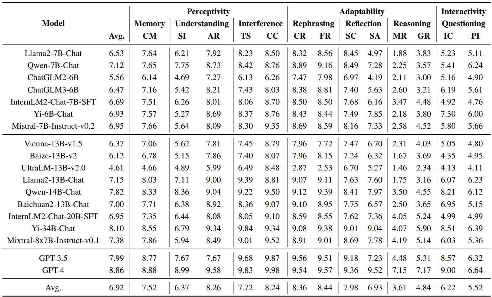

<div align= "center">
    <h1> MT-Bench-101 </h1>
</div>

<p align="center">  
<!-- A Fine-Grained Benchmark for Evaluating Large Language Models in Multi-Turn Dialogues Models -->
[ACL 2024] MT-Bench-101: A Fine-Grained Benchmark for Evaluating Large Language Models in Multi-Turn Dialogues
</p>

<p align="center">  
📃 <a href="https://arxiv.org/pdf/2402.14762" target="_blank">Paper</a> • 
🤗 <a href="https://huggingface.co" target="_blank">Data (WIP)</a> • 
🏆 <a href="" target="_blank">Leaderboard (WIP)</a>
</p>


## Todo

- [x] Release the research paper.
- [x] Release the evaluation code.
- [x] Release the dataset.
- [ ] Develop and launch an online leaderboard.


## 💥What's New

- **[2024.02.22]** Our paper is now accessible at https://arxiv.org/abs/2402.14762.
- **[2024.05.15]** MT-Bench-101 is accepted to the ACL 2024 main conference.
- **[2024.05.28]** Code and dataset are now available. 

## About MT-Bench-101

MT-Bench-101 is specifically designed to evaluate the finegrained abilities of LLMs in **multi-turn** dialogues. By conducting a detailed analysis of real multi-turn dialogue data, we construct a three-tier hierarchical ability taxonomy comprising **4208** turns across 1388 multi-turn dialogues in **13** distinct tasks. 

## Installation

We integrated our MT-Bench-101 benchmark into [OpenCompass](https://github.com/open-compass/opencompass), a comprehensive platform for large model evaluation. 

#### Create virtual env

```bash
conda create --name opencompass python=3.10 pytorch torchvision pytorch-cuda -c nvidia -c pytorch -y
conda activate opencompass
git clone https://github.com/mtbench101/mt-bench-101.git
cd mt-bench-101
pip install -e .
```

#### Data Preparation

Our data has been stored in the following folder.

```bash
# Dataset folder
data/subjective/mtbench101.jsonl
```


#### Evaluation

```bash
# run
python run.py configs/eval_subjective_mtbench101.py
# debug
python run.py configs/eval_subjective_mtbench101.py --debug
```

## Leaderboard



## Citation

If you find our work helpful, feel free to give us a cite.
```
@article{bai2024mt,
  title={MT-Bench-101: A Fine-Grained Benchmark for Evaluating Large Language Models in Multi-Turn Dialogues},
  author={Bai, Ge and Liu, Jie and Bu, Xingyuan and He, Yancheng and Liu, Jiaheng and Zhou, Zhanhui and Lin, Zhuoran and Su, Wenbo and Ge, Tiezheng and Zheng, Bo and others},
  journal={arXiv preprint arXiv:2402.14762},
  year={2024}
}
```
